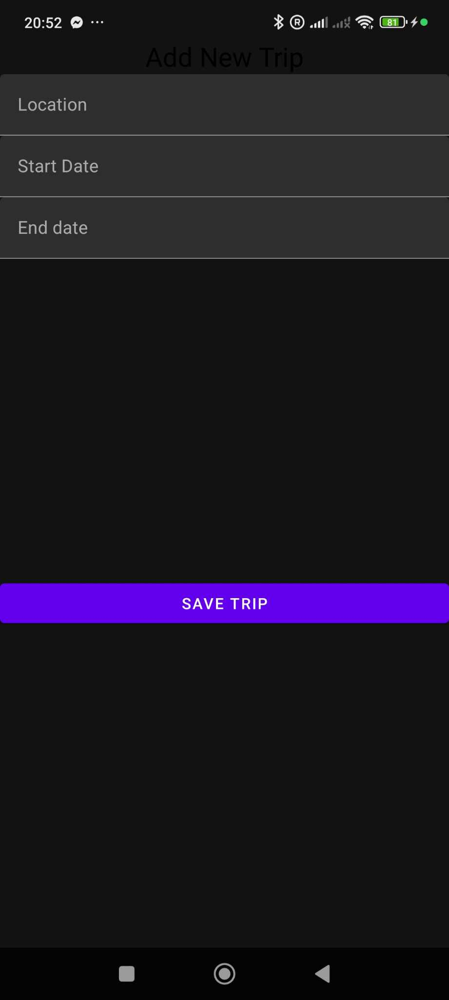
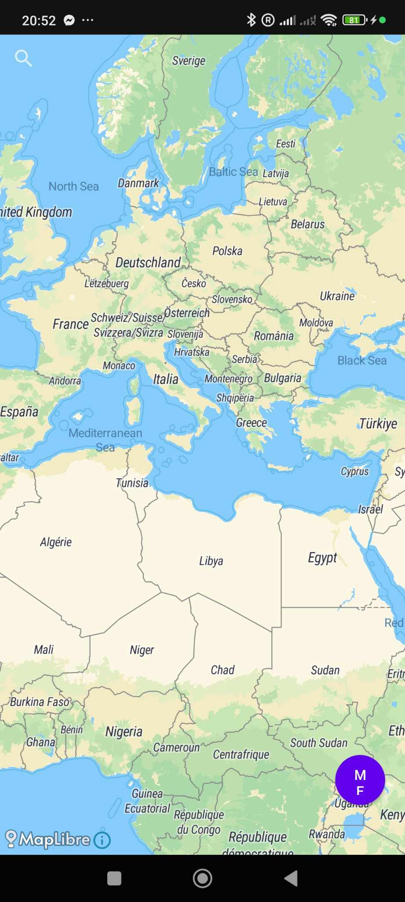

# BigJourney

An Android application developed in Kotlin that helps users organize and manage their trips. The application allows users to store travel information, tickets, photos and locations while integrating Firebase services and local storage.

## Features

- User authentication with Firebase
- Create, edit and delete trips
- Store and manage travel tickets
- Capture and upload photos
- Firebase Cloud Storage integration
- Room Database for local data persistence
- Google Maps integration
- Material Design user interface

## Technologies

- Kotlin
- Android Studio
- Firebase Authentication
- Firebase Storage
- Room Database
- Google Maps API
- Camera API
- Material Design Components

## Screenshots

| Login | home |
|-------|------|
|  |  |

| Add Trip | Map |
|-------------|--------|
|  |  |

## Installation

1. Clone the repository

```bash
git clone https://github.com/geosto20/BigJourney.git
```

2. Open the project in Android Studio.

3. Add your own `google-services.json`.

4. Sync Gradle.

5. Build and Run.

## Project Structure

```
app/
 ├── activities/
 ├── adapters/
 ├── database/
 ├── models/
 ├── firebase/
 ├── utils/
 └── ui/
```

## Future Improvements

- Weather integration
- AI travel recommendations
- Expense tracking
- Offline map support
- Cloud synchronization

## Author

**Georgios Stoikos**

Electrical & Computer Engineer

LinkedIn:
https://www.linkedin.com/in/giorgos-stoikos-7b6b99231/
